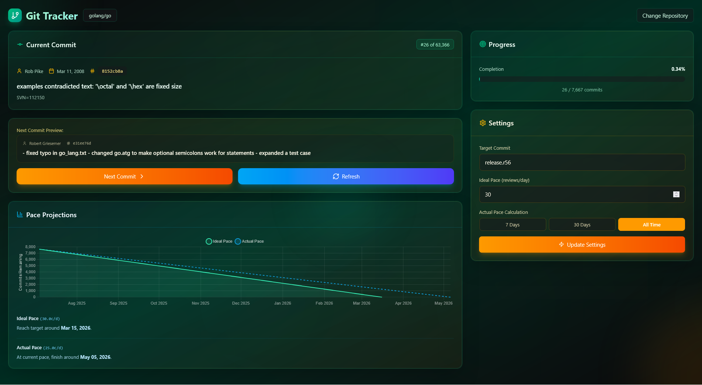

# 🚀 Git Tracker


An interactive web app to explore, learn, and track your progress through any Git repository, one commit at a time. This
project is a complete rewrite of the original Python/Flask `git-step` application, now built with the robust Laravel
framework.



---

## 🤔 Why Git Tracker?

Onboarding to a new codebase can be daunting. Reading the final state of the code only tells you *what* it does, not
*why* it was built that way. The real story—the decisions, the refactors, the bug fixes—is hidden in the Git history.

**Git Tracker** transforms the process of learning a codebase from passive reading into an active, guided journey. It
allows you to "replay" a project's history, stepping through each commit to understand the context and rationale behind
every change. It's the ultimate tool for developers who want to truly understand the DNA of a project.

## ✨ Features

* **Multi-Repository Management**: Add, select, and remove repositories from a central dashboard.
* **Commit-by-Commit Navigation**: Step forward through the entire history of any branch, from the initial commit to the
  latest.
* **Live Code Exploration**: Git Tracker checks out each commit's state in your local file system, allowing you to
  explore the full codebase in your favorite editor as it existed at that point in time.
* **Next Commit Preview**: See the subject and author of the upcoming commit before you advance. The app also stages the
  changes for the *next* commit, so you can see a diff of what's about to happen in your editor.
* **Progress Tracking & Projections**: Visualize your journey with a dynamic progress bar and a projection chart that
  estimates when you'll reach your target based on your pace.
* **Dynamic Pace Analysis**: Track your review performance with an "Actual Pace" metric, calculated based on your
  activity in the last 7 days, 30 days, or over all time.
* **Targeted Learning**: Set your goal to the `latest` commit for a moving target, or specify a particular release `tag`
  or `SHA` to focus on understanding a specific feature.
* **Remote Sync**: Pull the latest changes for a repository from its `origin` remote with a single click.
* **Robust Persistence**: All repositories and your progress are saved in a database, so you can pick up right where you
  left off.
* **Stunning & Reactive UI**: A modern, glassmorphism-inspired interface built with Tailwind CSS and powered by Livewire
  for a seamless, single-page application feel without writing complex JavaScript.

## 🛠️ Tech Stack

* **Backend**: PHP 8.2+, Laravel 12, Livewire 3
* **Frontend**: Blade, Tailwind CSS, Chart.js, Lucide Icons
* **Database**: Eloquent ORM (ready for SQLite, MySQL, PostgreSQL, etc.)
* **Build Tool**: Vite

## 🚀 Getting Started

Follow these instructions to get a local copy up and running.

### Prerequisites

* PHP 8.2+
* Composer
* Node.js & npm
* Git (installed and accessible in your system's PATH)
* A supported database (the following instructions use SQLite for simplicity)

### Installation

1. **Clone the repository:**
   ```sh
   git clone https://github.com/khanra17/git-tracker.git
   ```

2. **Navigate to the project directory:**
   ```sh
   cd git-tracker
   ```

3. **Install PHP dependencies:**
   ```sh
   composer install
   ```

4. **Create your environment file:**
   ```sh
   cp .env.example .env
   ```

5. **Generate an application key:**
   ```sh
   php artisan key:generate
   ```

6. **Configure your `.env` file for SQLite.** This is the simplest way to get started. Make sure these lines are present
   in your `.env` file:
   ```dotenv
   DB_CONNECTION=sqlite
   DB_DATABASE=database/database.sqlite
   ```
   > **Note:** If you use an absolute path for `DB_DATABASE`, ensure it points to the `database/database.sqlite` file
   inside your project directory.

7. **Create the SQLite database file:**
   ```sh
   touch database/database.sqlite
   ```

8. **Run the database migrations:** This will create the `repositories` and `review_logs` tables.
   ```sh
   php artisan migrate
   ```

9. **Install frontend dependencies:**
   ```sh
   npm install
   ```

10. **Build frontend assets:**
    ```sh
    npm run build
    ```

### Running the Application (Development)

```sh
composer dev
```

3. **Open your browser** and navigate to `http://127.0.0.1:8000`.

## 📖 How to Use

1. Upon launching, you will see the **Repository Manager** dashboard.
2. Click the **"Add New Repository"** card to open the modal.
3. Enter the **absolute local path** to a Git repository on your machine (e.g., `/Users/you/projects/my-cool-project`).
4. Click **"Add Repository"**. The application will validate the path and redirect you to the main tracker view.
5. The app initializes and displays the first commit of the repository's default branch.
6. **Crucially, open the repository folder in your code editor (like VS Code)**. You will see the files update with each
   step. The staged changes in your editor will show the diff for the next commit.
7. Use the **"Next Commit"** button to step through the history.
8. Use the **Settings** card to customize your target commit and ideal pace. The projection chart will update
   automatically.
9. Click the **"Refresh"** button to fetch the latest changes from the remote repository.

## 📄 License

Distributed under the MIT License. See `LICENSE` for more information.

---

Made with ❤️ by [Suman Khanra](https://github.com/khanra17)